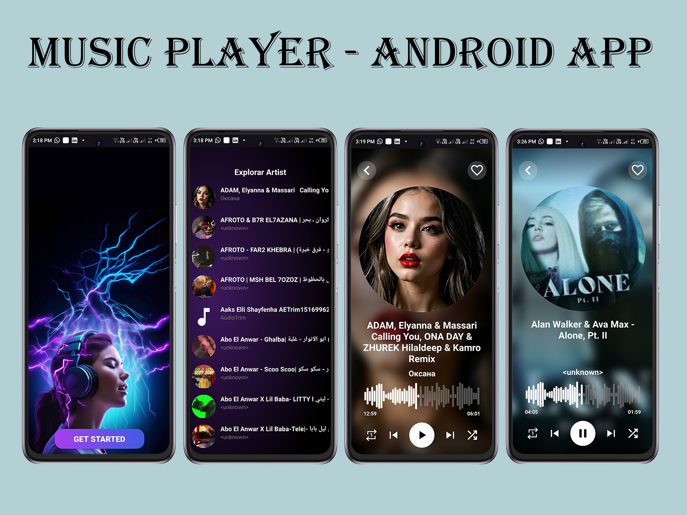

# 🎵 Local Music Player App – Modern Android Music Experience

An elegant and modern offline music player built with Java and Android architecture components.  
Designed for smooth performance, dynamic UI, and an immersive user experience.

---

## ✨ Features

- 🎧 **Play local music** directly from device storage  
- 💿 **Animated album cover** that rotates while music plays  
- 🌀 **Smooth transitions** and animated UI interactions  
- 🎨 **Modern, clean design** following Material Design principles  
- 🗂️ Browse music by **artist, album, or playlist**  
- 🔁 Shuffle, repeat, and background playback support  
- 📊 Reactive UI with **ViewModel & LiveData**  
- ⚡ Optimized for performance with minimal memory usage  
- 🌙 Optional dark mode for a comfortable night experience

---

## 🛠️ Built With

- **Java** – Core application logic  
- **Android Jetpack Components** – ViewModel, LiveData  
- **MediaPlayer API** – Native Android music playback  
- **RecyclerView** – Dynamic song and album lists  
- **Animation & Motion** – Album rotation, smooth transitions  
- **Material Design 3** – UI/UX principles  
- **MVVM Architecture** – For clean and maintainable code

---

## 📸 Screenshots

  

---

## 📁 Project Structure

# RecyclerView adapters ├── view/ ├── adapter/
# Activities and Fragments ├── viewmodel/
# ViewModels for data handling ├── model/ 
# Data models (Song, Album, etc.) ├── utils/
# Helper functions and tools └── res/
# Layouts, animations, drawables

---

## 🚀 Getting Started

1. Clone the repository  
2. Open with **Android Studio**  
3. Grant **storage/media access permissions**  
4. Run the app on a device/emulator with local music files

---

## 📌 Notes

- This app works **fully offline**, no external API is used  
- You can extend it by adding:
  - Equalizer & bass booster  
  - Lyrics synchronization  
  - Theme customization  
  - Jetpack Compose integration

---

## 🤝 Contributing

Feel free to open issues or pull requests.  
Your feedback and contributions are appreciated!

---

## 👨‍💻 Author

Made with ❤️ by **Ramzy Ahmed**  
[LinkedIn](https://www.linkedin.com/in/ramzy-ahmed)  
[GitHub](https://github.com/ramzy-ahmed)

---

## 🪪 License

This project is licensed under the MIT License.
